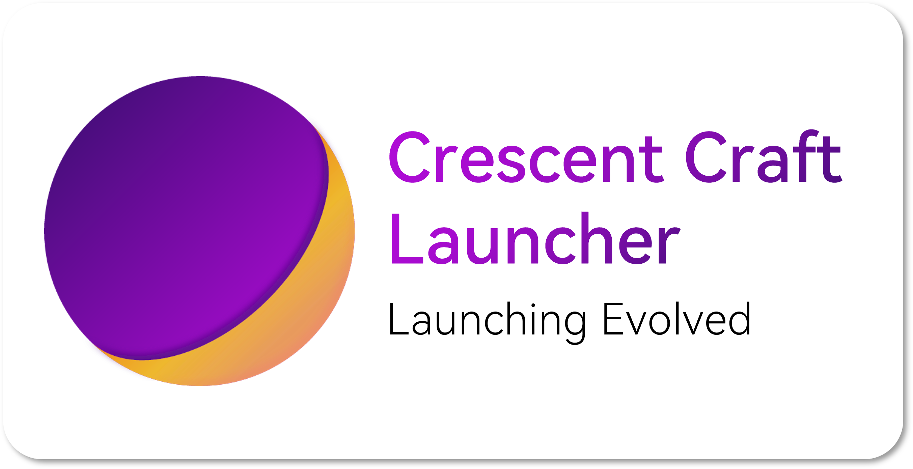

  <image width="120em" src="media/applogo.svg" />
  

<h1 align="center">Crescent Craft Launcher</h1>

A community friendly, plugin driven Minecraft launcher.

  <a>English | <a href='./README.zh-CN.md'>简体中文 </a>

## Intro

- ⚠ It will not be developed until I entered university in 2025.
- ℹ Before CCL is developed and released, you may want to take a look at [COL](https://github.com/wind-XF/COL) first

